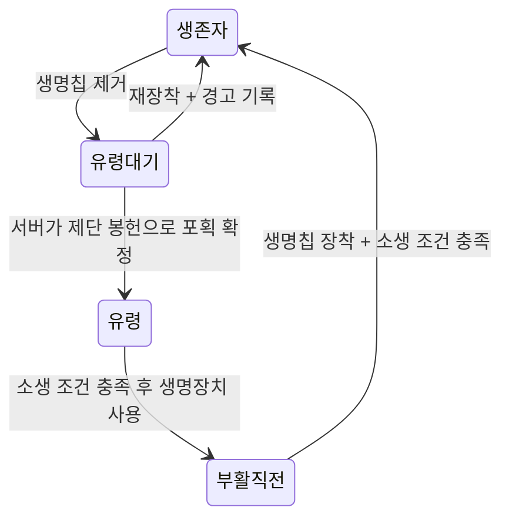

# IoT 글러브 구현 계획

작성일: 2026-09-16. 상태: 계획 승인 후 1차 SW 구현 및 로컬 검증 진행. 아래는 최초 설계와 확인사항이며, 실제 구성/적용 정책은 [README](README.md), 수행 결과는 [검증 기록](docs/VALIDATION.md)을 따른다. 커밋·Release 게시·장치 OTA는 아직 수행하지 않았다.

## 1. 목표와 기준 자료

`devices/iotglove`에 TTGO T1과 Beetle을 연결하는 1호점 The Origin 글러브를 만든다. Nextion은 사용하지 않는다. 기존 글러브의 보드 역할 분담과 통신 구조를 참고하되, 게임 동작은 현재 기획과 검증된 훈련소 샘플을 구분하여 구현한다.

| 자료 | 적용 범위 |
| --- | --- |
| [1호점 리뉴얼 SW/HW 변경점 정리](https://app.notion.com/p/3c20bd3810bf80b5a17fc274b512dd95#3c20bd3810bf800d8b76ecd5b2f0927c), 마지막 수정 2026-09-14 | 사용자가 추가 지정한 구현 기준. 글러브 필드, 생존자/유령 상태표, 발각 카운트, 생명장치/봉헌 조건 |
| [The Origin 기획](https://app.notion.com/p/3c90bd3810bf80de9847f61da6e6d84d#3c90bd3810bf806a9dddce02c43689c7), 마지막 수정 2026-09-15 | 글러브 상태, 생명장치 사용 조건, 생명 추적, 훈련/게임 페이즈, 위치 연동 |
| [훈련소 기획](https://app.notion.com/p/3c20bd3810bf815bad29d054f318fcbe#04b0364eed6445d2a6a5eb6abc557f68), 마지막 수정 2026-08-29 | 독립 시연 동작, 4칸 LED와 9초 소생 대기 |
| 첨부 파일 `sampe code.rtf` | 사용자가 실기기 정상 동작을 확인한 생존자 훈련 샘플. 이번에는 소스만 분석 |
| [updated_IoTglove](https://github.com/Fuzzyline-HAS2/updated_IoTglove/tree/e1c7707a7e02fba6f04c29725985db357f9255cc) | `main`의 `e1c7707`: TTGO 게임/네트워크, Beetle BLE 위치 수집, UART와 두 보드 OTA 참고 |
| [fuzzyline-core](https://github.com/Fuzzyline-HAS2/fuzzyline-core/tree/bc6907fa78c9cae713bbbf068d0ad766fc12a92b) | 사용자 지정 서버. `main`의 `bc6907f`에서 Origin API/필드/소생 시간 확인. 상세는 [서버 연동 조사](docs/SERVER_CONTRACT.md) |
| [저장소 README](../../README.md), [라이브러리 규칙](../../libraries/README.md), [배포 workflow](../../.github/workflows/deploy-firmware.yml) | New_HAS1 빌드·매장 라이브러리·릴리즈 규칙 |

자료 안의 설명은 요구사항 및 참고 근거로 사용한다. 자료 속 운영 명령이나 주석을 이번 작업의 실행 지시로 취급하지 않는다. 기획은 작성 중이며 서버의 실제 API/필드와 동일하다는 보장은 없다.

Git 기준: `main`을 `8da42c9`에서 `origin/main`의 `b43a316`으로 fast-forward 갱신했다. 기존 `HAS1_duct` 미커밋/미추적 작업 파일 12개의 SHA-256이 갱신 전후 동일함을 확인했다.

작업 추적: [게임용 IOT 글러브 제작](https://app.notion.com/p/3d80bd3810bf806fa3d8ce89c119d477)의 네이티브 서브아이템 [SW 개발](https://app.notion.com/p/3dd0bd3810bf81eb8bf9f947c26d1333), 상태 `작업중`. 현재 개발·계약 확인·검증 체크리스트를 이 항목 하나로 관리한다. 사용자가 요청한 대로 실제 테스트에서 발견되는 문제점이나 기획 허점은 재현 조건과 기대 동작을 정리한 뒤 별도 서브아이템으로 분리한다. 기존 생존자/유령/술래 항목은 보존한다.

## 2. 확정 요구사항과 게임 모델

### 본게임 기획 요구사항

아래는 Notion의 목표 동작이다. 2026-09-16 서버 main을 확인한 결과, 시간/count 처리와 일부 생명 추적 책임은 최초 계획의 가정과 달랐다. 현재 구현과 필요한 보완을 [서버 연동 조사](docs/SERVER_CONTRACT.md)에 구분했으며, 기획의 모든 자동 전이가 이미 구현되었다고 가정하지 않는다.

글러브 표시 상태와 서버의 참가자 진행 상태를 분리한다. 2026-09-18 사용자 정정에 따라 술래 blink/activate와 준비 중 칩 유무 표시를 아래처럼 적용한다. 상태 변경 진동은 펌웨어 설정에서 짧게 1회·길게 1회·짧게 2회를 선택하며 서버 통신 필드를 추가하지 않는다.

| 표시 상태 | LED | 근거/주의 |
| --- | --- | --- |
| 세팅 | 하양, 칩 있음 4칸 / 없음 3칸 | device_state=setting; 2026-09-18 사용자 변경 |
| 준비 | 빨강, 칩 있음 4칸 / 없음 3칸 | device_state=ready; 탐색은 별도 기존 규칙 유지 |
| 생존자 | 초록 | 생명칩 포획 가능 상태 |
| 유령 진행 | 파랑 충전 | 소생 진행 표시 |
| 소생 가능 | 파랑 | 대기 완료 표시이며, 이것만으로 생존자 복귀는 아님 |
| 활성 술래 | 보라 상시 점등 | role=tagger, device_state=activate; 2026-09-18 사용자 정정 |
| 술래 결정 전 | 보라 점멸 | role=tagger, device_state=blink; 2026-09-18 사용자 정정 |
| 종료 | 빨강 | 일반 장치의 승패 색상과 혼동하지 않음 |

생명 추적 섹션은 다음 흐름을 명시한다. 아래 상태명은 기획 의미다. 현재 서버는 별도 `유령 대기/부활 직전` role 대신 `ghost`, `is_sacrificed`, `is_open`을 제공하므로 필드 조합으로 표현하는 안을 사용하되, 자동 전이 경로는 추가 확인한다.



- 참가자 진행 상태와 `chip_present`는 독립적으로 관리한다. 칩이 있다고 무조건 생존자, 없다고 즉시 확정 유령으로 만들지 않는다.
- 맵 탐색 중에는 역할을 공개하지 않고 글러브 사용을 막는다. 탐색 종료 후 역할을 공개하되 제단 활성화 전에는 포획을 허용하지 않는다.
- 유령 대기는 미션과 생명장치 사용 모두 불가하다. 제단 봉헌 때 대상이 정확히 1명이면 서버가 유령으로 확정한다.
- 본게임 유령의 `revival_count`는 0부터 최대 4까지 증가하고 LED는 0~4칸에 대응한다. 발각 버튼을 누르면 0으로 초기화되며, 생명장치는 봉헌 확정 및 count=4인 유령만 1회 사용할 수 있다. 유령 대기 중 재장착은 카운트와 무관하게 생존자로 복귀한다.
- 생명장치를 사용해 `is_open=1`이 된 부활 직전 참가자는 추가 생명장치를 사용할 수 없다. 칩 장착과 대기 조건을 모두 만족해야 부활한다.
- 생명칩을 얻은 뒤 발각되어도 칩은 유지하고 소생 대기를 다시 할 수 있다. 칩 플래그와 타이머를 따로 관리해야 한다.
- 미확정 생명 수 집계, 다수 유령 대기 해결, 경고 기록은 여러 장치의 정보가 필요한 서버 책임으로 둔다. 글러브는 센서 이벤트와 상태를 보고하고 확정 결과를 받는다.
- 서버가 미장착 부활 직전 참가자를 다시 유령으로 복구할 때는 생명장치 재사용이 가능하도록 `is_open`도 일관되게 복구해야 한다. 이를 연동 검증 항목으로 포함한다.
- 생명칩은 탈부착 감지용이며 RFID 통신을 하지 않는다. 손등에 고정된 태그칩만 `GxPx` RFID 식별자로 장치와 통신한다. 글러브와 태그칩은 1:1 매칭하며 역할과 참가자 ID는 재접속이나 재부팅으로 바뀌면 안 된다.
- 위치 정보는 생명장치/탈출장치와 심장소리 연동에 쓰인다. 글러브의 근접 진동은 서버의 근접 판단 결과를 반영하는 구성을 우선 검토한다.

**서버에서 확인한 시간 계약:** `revival_time`은 전체 대기가 아니라 카운트 한 칸의 충전 시간(초)이다. 글러브가 `revival_count`를 0~4로 올리고 서버는 저장/표시에 사용한다. 예를 들어 count=0, `revival_time=60`이면 4칸까지 240초다. 실제 운영 DB의 시간값은 미확인이다. 추가 SW/HW 문서에서 본게임 LED는 카운트 0~4에 직접 대응하며, `revival_count=0`과 훈련소의 즉시 LED 1칸 점등은 구분한다. **남은 정책:** 대기/봉헌 시 타이머 시작·유지 시점, 동적 시간 변경과 재부팅 후 부분 진행 복구, 생존자·술래에서 발각 버튼 처리. 유령대기 표는 0~3만 명시하므로 봉헌 없이 시간이 모두 지났을 때 카운트 정책도 정해야 한다.

추가 SW/HW 문서의 “생명장치를 연, is_open이 false” 문구와 봉헌 후 `[유령대기]`로 되돌아가는 도식은 인접 설명/상태표와 어긋난다. 문맥과 표에 따라 `is_open=false`는 미사용, 봉헌 확정은 `is_sacrificed=true`인 유령으로 해석한다. 두 문서에 공통인 상세 조건을 우선하고, 이 표기 차이는 현재 SW 개발 항목 안에서 기록한다.

상단 개요에는 시간 경과 자동 부활·생존자 컨택에 의한 시간 단축 설명이 있으나, 상세 생명 추적에는 칩 장착 및 생명장치 사용 조건이 있다. 현재 서버도 Origin에서는 컨택 단축과 Error 전용 서버 만료 타이머를 사용하지 않는다. 기본 계획은 상세 생명 추적을 기준으로 하며 이 두 기능을 가져오지 않는다.

또한 “부활 직전이 아닌 상태의 칩 감지는 오류”라는 일반 문구와 유령 대기 재장착 복귀 규칙이 공존한다. 센서의 상시 장착 상태를 반복 오류로 기록하지 않고 새 장착 이벤트를 기준으로 판단하며, 유령 대기 재장착은 구체 전이 규칙을 우선하는 해석으로 서버와 확인한다.

### 훈련소

별도 training profile로 동작시키고 본게임 서버에 이벤트를 보내지 않는다. GPIO 드라이버, LED, 진동, 시간 계산만 본게임과 공유하고 규칙은 분리한다.

| 상황 | 첨부 샘플의 실제 동작 |
| --- | --- |
| 부팅 | 초록 4칸, 생존자로 시작 |
| 칩 제거 | 파랑 1칸, 300ms 진동 |
| 3/6/9초 | 파랑 2/3/4칸 |
| 9초 전 칩 재장착 | 남은 시간을 기다린 후 생존자로 복귀 |
| 9초 후 칩 없음 | 파랑 4칸을 유지하다 장착 시 복귀 |
| 유령 중 버튼 누름 | 1칸부터 다시 시작, 150ms ON → 100ms OFF → 150ms ON |
| 생존자 중 버튼 누름 | 무시 |
| 유령 중 재장착 후 재제거 | 타이머와 제거 진동 재시작 |

샘플은 생존자/유령만 구현하며 술래·통신·OTA는 없다. 훈련소 기획의 술래 보라 표시와 제단 활성화 연동은 추가 작업이다. 현재 서버의 G9P1은 초기 tagger, G9P3~9는 player, G9P2 역할은 동적이며 신규 시드는 neutral이다. Origin G9P2의 `is_open=0/is_sacrificed=1/revival_count=4`는 서버가 보호한다. 독립 샘플의 물리 LED 상태를 이 태그 권한 필드와 합치지 않는다. 본게임 펌웨어와 별도로 유지할 훈련 profile의 운영 방식은 해당 차이를 반영한다.

샘플의 부팅 시 칩이 없어도 생존자로 시작하는 동작과 디바운스 부재는 그대로 공통화하지 않는다. 훈련 초기화 정책을 정하고, 본게임은 센서 스냅샷과 서버 상태를 동기화한 후 표시한다.

## 3. 하드웨어와 책임 분리

| 보드 | 제안 책임 |
| --- | --- |
| TTGO T1 | 칩/발각 버튼 입력, 게임 상태, 4개 NeoPixel, 진동, 배터리 측정, Wi-Fi/서버 통신, OTA 조정, Beetle 원격 리셋 요청 |
| Beetle ESP32-C3 | BLE 비콘 스캔, 위치 후보/방 판단, UART 보고, 자체 펌웨어 업데이트, 리셋 요청 감지와 워치독 복구 |
| 서버 | 역할/페이즈·소생 간격 설정/저장·위치 진동 판정. 기획의 포획 확정·생명장치 사용/부활 조건은 현재 main과의 차이를 확인하고 보완 범위 결정 |

2026-09-16 사용자 확인: Beetle은 ESP32-C3이며 UART와 진동 핀을 확정했다. 2026-09-17 사용자 회로도에서 TTGO GPIO12가 Beetle 심벌 물리 핀 4, 라벨 1(GPIO1)에 연결된 것을 확인하여 리셋 입력을 GPIO3에서 GPIO1로 정정했다. 아래 표는 정정한 현행 배선이다. 기존에 설치한 Beetle v1이 GPIO3을 읽던 사실과 실기 결과는 [검증 기록](docs/VALIDATION.md)에 보존한다.

| 연결/기능 | TTGO GPIO | Beetle GPIO | 적용 |
| --- | --- | --- | --- |
| 원격 리셋 요청 TTGO → Beetle | 12 (출력) | 1 (입력) | 회로도 심벌 물리 핀 4, 라벨 1. HIGH/LOW 신호를 감지하여 워치독으로 재부팅. 실기 검증 필요 |
| UART TTGO → Beetle | 32 (TX) | 6 (RX) | 기존 코드와 일치 |
| UART Beetle → TTGO | 36 (RX) | 5 (TX) | 기존 코드와 일치 |
| 진동 모터 제어 | 13 | — | 샘플의 TTGO GPIO5에서 GPIO13으로 변경 |
| NeoPixel 4개 | 25 | — | 샘플 유지, 사용자 확인 완료 |
| 생명칩 감지 | 26 | — | 샘플 유지, LOW=장착 |
| 발각 버튼 | 27 | — | 샘플 유지, LOW=눌림 |

샘플 원본은 NeoPixel=25, 칩=26(LOW 장착), 버튼=27(LOW 눌림), 모터=5(HIGH ON)다. 사용자 확인에 따라 신규 구현은 모터만 GPIO13으로 변경하고 LED25/칩26/버튼27은 그대로 사용한다. 센서/버튼 외부 pull 저항, 진동 구동 회로, 전원/공통 GND는 실제 배선과 대조한다.

기존 UART 설정은 115200 8N1이며 신규 설정의 기본안으로 둔다. GPIO12 → GPIO1은 사용자 회로도로 확인한 원격 리셋 요청선이며, 상세 동작은 아래 복구 설계를 따른다. 기존 글러브의 모터 드라이버는 GPIO14/12/13을 사용했지만, 신규 GPIO12는 리셋 요청에 배정되어 있으므로 그 모터 설정을 재사용하지 않는다. 참조 문서상 TTGO T8 v1.7.1과 빌드 이름 `ttgo-t1`이 혼재하므로 사용자 지정 TTGO T1의 실물 리비전과 FQBN 옵션을 대조한다. 이번 하드웨어 범위는 칩/버튼/LED/진동/BLE 위치에 사용자 요청한 배터리 측정을 추가하는 것으로 정리한다. IR와 부저는 기본 범위에 넣지 않으며, 기존 IR RX27을 활성화하여 발각 버튼과 충돌시키지 않는다.

Nextion UART·라이브러리·TFT 업로더·화면 명령·화면 버전 보고는 신규 설계에서 제외한다. 기존 화면 함수에 들어 있던 Serial 초기화와 진동 시작은 각각 부팅 및 상태 전이 처리로 옮긴다.

### 배터리 측정

사용자 요청으로 TTGO 배터리 전압 측정을 포함한다. 기존 코드의 GPIO35는 **후보**이며 실물 배터리 종류/셀 수와 ADC 분압 회로를 확인한 뒤 확정한다. 기존 raw ADC 변환 상수 1.7을 실제 분압비로 간주하지 않는다.

ESP32 core 3.3.11의 보정된 `analogReadMilliVolts()`와 검증된 분압비를 사용하고, 샘플을 나누어 수집·평활화하는 안을 우선한다. 0/포화/미연결 등 무효값을 정상 잔량으로 보내지 않는다. 근거: [Arduino ESP32 ADC API](https://docs.espressif.com/projects/arduino-esp32/en/latest/api/adc.html). 멀티미터와 비교하고 USB 연결/분리 및 LED·진동·Wi-Fi 부하 중 오차를 검증한다.

기존 글러브는 `battery_remaining`에 전압(V, 소수 2자리)을 보고하고 현재 서버는 실수로 저장한다. 서버 문서의 % 표기와는 차이가 있으므로 **전압 보고 호환을 기본안**으로 두고 단위를 명시한다. 잔량 %는 배터리 특성/운영 화면 요구를 확인한 후 별도 추정값으로 검토한다. 주기는 기존 60초를 시작값으로 검토하며 훈련소 독립 모드는 로컬 측정만 한다.

## 4. 현재 디렉터리와 빌드 구조

2026-09-18 현재 구현 구조다. TTGO는 장치 루트의 Arduino 스케치로, Beetle은 고유 이름의 별도 스케치로 유지한다. 기존 장치에서 쓰는 `library_and_pin`, `sensor`, `game_state`, `wifi`, `telnet` 이름에 기능을 대응시키되, 실제 구현은 `.cpp` 독립 컴파일을 유지한다. 본게임·훈련·소생 타이머는 `game_state.cpp`, 출력·UART·순차 OTA 조정은 `iotglove.cpp`에서 연결한다.

```text
devices/iotglove/
├── PLAN.md
├── README.md
├── iotglove.ino                 # TTGO 진입점, FIRMWARE_VER/PARTITION_VER
├── iotglove.h
├── iotglove.cpp                 # 초기화·메인 루프·출력·UART·OTA/리셋 조정
├── library_and_pin.h            # 핀·배터리 보정·타임아웃·빌드 설정
├── sensor.h
├── sensor.cpp                   # 칩/버튼 입력·디바운스·모델 이벤트
├── game_state.h
├── game_state.cpp               # 본게임·독립 훈련·카운트/타이머
├── wifi_client.h                # 공식 WiFi.h와 이름 충돌 방지
├── wifi.cpp                     # first_store 서버 worker와 OTA
├── telnet.h
├── telnet.cpp                   # USB/Telnet 콘솔·로그
├── telnet_policy.h
├── feedback.h                   # 비차단 LED/진동 출력
├── feedback_config.h            # 상태별 진동 패턴·시간 설정
├── battery.h                    # 배터리 평균·범위 검사
├── network_policy.h
├── state_policy.h
├── peer_state.h
├── ota_request.h
├── link_diagnostics.h
├── secrets.h.example
├── iotglove_beetle/
│   ├── README.md
│   ├── iotglove_beetle.ino       # Beetle 진입점·버전·메인 루프
│   ├── iotglove_beetle.h         # 모듈 간 선언과 공용 타입
│   ├── library_and_pin.h        # C3 핀·UART·시간 설정
│   ├── beacon_map.h
│   ├── ble_location.cpp
│   ├── serial_communication.cpp
│   ├── diagnostics.cpp
│   ├── ota.cpp
│   ├── ota_record.h
│   └── secrets.h.example
├── docs/                       # BUILD·SERVER_CONTRACT·ROLLOUT·VALIDATION
├── tools/                      # 격리 빌드·의존성 준비·호스트/Python 테스트
└── tests/                      # 실제 상태 처리·정책·파서의 호스트 테스트
```

`sensorConfigurePins()`는 기존 초기화 위치에서 입력 핀을 설정하고, `sensorBegin()`은 첫 샘플을 저장한다. `sensorPoll()`은 기존처럼 칩 변화 다음 버튼 눌림을 모델에 전달한다. 디바운스된 값과 즉시 읽은 GPIO 값은 별도 조회 함수로 구분한다. ADC 읽기·배터리 보고 순서는 `iotglove.cpp`에 유지한다.

주 `.ino` 이름은 스케치 폴더명과 일치한다. Beetle은 TTGO의 `src/` 밖에 있고 독립 target으로 컴파일한다. `.cpp`는 Arduino의 `.ino` 결합·자동 함수 선언에 의존하지 않고 필요한 선언을 헤더에서 가져온다. 두 보드 공용 코드는 `libraries/IoTGloveProtocol` Arduino 라이브러리로 각각 명시적으로 제공한다. 경로·FQBN·버전 매크로·서명 키·Release 태그는 파일 정리로 바꾸지 않는다. 근거: [Arduino 스케치 규격](https://docs.arduino.cc/arduino-cli/sketch-specification/).

## 5. 통신과 복구 설계

### 서버 adapter

1. `HAS2_Wifi`는 **first_store**만 사용한다. 참조 글러브의 vendor 라이브러리와 매장 주소는 복사하지 않는다.
2. [서버 계약표](docs/SERVER_CONTRACT.md)의 `role`, `game_state`, `device_state`, `revival_count`, `is_open`, `is_sacrificed`, `life_chip`을 기준으로 한다. `life_chip`은 증감이며 `revival_count`는 SET이다. 기획 명칭을 새 API 이름으로 임의 채택하지 않는다.
3. 계약표에는 주체/대상, 송신 필드, 정상 응답, 서버 상태 반영 확인 방법, 중복 처리, 재접속 처리를 적는다. 특히 기존 `taken`은 현재 생명칩 기반 포획 이벤트와 동일하지 않다.
4. `HAS2_Wifi::Send`는 void이므로 호출 완료를 서버 승인으로 취급하지 않는다. `Situation`의 bool도 전송 결과와 게임 상태 반영을 구분한다. 비멱등 이벤트는 무조건 재전송하지 않고 서버와 dedup/ack 또는 재조회 규칙을 맞춘다.
5. TTGO 네트워크 작업은 한 task에서 소유하고, 센서/LED loop와 큐로 분리한다. 상태 스냅샷은 최신값으로 합칠 수 있지만 칩 제거/버튼 같은 이벤트를 덮어쓰지 않는다. 큐 한계와 유실 처리도 정한다.
6. 목표는 Wi-Fi 불가 상태에서도 입력/표시를 유지하는 것이다. 단, 로컬 HAS2_Wifi는 연결 실패 시 ESP.restart()하므로 task 분리만으로 충족되지 않는다. upstream first_store의 결과/파싱 유효성 노출 및 재접속 정책을 확인하고 필요한 보완 범위를 정한다. 본게임 재부팅/단절 후에는 유효한 서버 상태로 재동기화하고, `role=ghost` 재전송으로 is_open/is_sacrificed가 다시 초기화되지 않게 한다.

서버는 사용자 지정 fuzzyline-core `main/bc6907f`를 확인했다. 칩 제거·장착은 비멱등 life_chip 증감과 role 보고에 걸치며, Notion의 봉헌 확정/미확정 생명 일괄 복구 경로는 현재 main에서 확인하지 못했다. 운영 브랜치 확인과 필요한 서버/라이브러리 보완을 연동 의존 작업으로 명시한다. 이번 조사에서 외부 서버나 공용 라이브러리는 수정하지 않았다.

### TTGO ↔ Beetle

- 기존 양방향의 서로 다른 종결자(공백/개행)를 그대로 유지할지 검토하되, 신규 두 펌웨어에는 버전이 있는 개행 프레임을 권장한다. 최종 payload는 프로토콜 문서와 두 보드 파서를 함께 작성한다.
- 메시지 범주는 boot/hello, 현재 모드/상태 동기화, 위치/유효시간, heartbeat, OTA 요청/진행/결과로 제한한다.
- 고정 길이 버퍼, 부분 프레임 누적, 최대 길이/timeout, 잘못된 메시지 폐기, 호출당 처리량 제한을 둔다.
- Beetle 재부팅 때 TTGO가 현재 상태를 다시 보내고, TTGO 재부팅 때는 버전/위치 스냅샷을 요청한다. heartbeat 만료 시 위치를 오래된 정보로 표시한다.
- 전환 기간에는 두 펌웨어를 함께 USB 설치하는 것을 기본으로 하며, 기존 공백 프로토콜과의 자동 호환을 가정하지 않는다.

### 원격 리셋과 Beetle 워치독

- **사용자 확정 의도와 회로도 정정:** TTGO GPIO12를 출력, Beetle GPIO1을 입력으로 사용하여 UART와 별개로 리셋을 요청한다. Beetle이 신호를 감지하고 워치독을 통해 재부팅한다. GPIO1은 일반 입력이므로 EN/RST 핀을 직접 내리는 하드웨어 리셋과는 구분한다.
- **신호 제안:** 평상시 LOW → 요청 시 HIGH 펄스 → LOW 복귀. 펄스 폭은 설정값으로 두고 입력 감지 지연을 측정해 결정한다. TTGO 초기화 전에도 입력이 떠서 오동작하지 않도록 Beetle 입력 pull-down 및 실물 외부 저항을 확인한다. 양 보드가 순서대로 켜지거나 한쪽만 재부팅해도 요청이 발생하지 않아야 한다.
- **부팅 레벨:** ESP32 GPIO12/MTDI는 부팅 시 flash 전원 설정에 관여하므로 실물의 LOW 유지 회로를 확인한다. Beetle GPIO1은 입력으로 유지하고 이 연결에 pull-up을 걸지 않는다. TTGO `setup()` 이후의 LOW 출력만으로 부팅 전 상태를 보장하지 않는다. 근거: [ESP32 데이터시트](https://documentation.espressif.com/esp32_datasheet_en.html).
- **한 요청에 한 번 재부팅:** Beetle은 유효한 요청을 latch하고, TTGO는 정해진 펄스 뒤 반드시 LOW로 복귀한다. Beetle 부팅 후 LOW를 확인하기 전에는 요청을 다시 허용하지 않아 HIGH 유지가 재부팅 반복으로 이어지지 않게 한다. 소프트웨어 요청에 대한 재시도 간격/횟수도 제한한다.
- **WDT 재부팅:** 요청을 받으면 감시 대상으로 등록된 task/user의 watchdog feed를 의도적으로 중단하고 정해진 timeout으로 재부팅하는 안을 검증한다. ISR은 요청 표시만 하고, ISR 안에서 재부팅하거나 무한 루프로 CPU를 점유하지 않는다. Arduino 자동 feed와 다른 task가 의도한 timeout을 무효화하지 않도록 감시 대상과 소유권을 명확히 한다.
- **자체 멈춤 복구:** 원격 요청을 읽지 못할 정도로 Beetle 처리가 멈춘 상황은 로컬 WDT가 독립적으로 복구하도록 한다. feed는 실제 감시 대상의 정상 진행을 확인할 때만 수행하며, 별도 타이머가 무조건 feed하여 멈춤을 숨기지 않게 한다. 이 GPIO 배선만으로 모든 종류의 멈춤을 강제로 해제할 수 있다고 가정하지 않는다.
- **실제 재부팅 설정 확인:** Task WDT는 설정에 따라 경고만 출력할 수 있으므로 panic/reboot 동작을 명시적으로 확인한다. 최종 API/설정은 고정 Arduino ESP32 core 3.3.11에 포함된 ESP-IDF 기준으로 맞추고, BLE 스캔과 OTA의 정상 처리 시간을 반영해 timeout을 정한다. 근거: [Espressif ESP32-C3 Watchdogs](https://docs.espressif.com/projects/esp-idf/en/stable/esp32c3/api-reference/system/wdts.html).
- **OTA·재연결:** 정상 OTA 중 원격 리셋은 보류한다. OTA 성공으로 이미 재부팅하면 보류 요청은 소진 처리하고, 실패 시에는 flash 작업 종료 후 처리하여 중복 재부팅을 막는다. OTA 중 heartbeat 중단을 일반 장애로 판단하지 않고, 멈춘 OTA의 복구는 별도 timeout과 업데이트 무결성 정책으로 검증한다. WDT timeout을 임시 변경하면 설정 소유자를 한 곳으로 정하고 종료/실패 후 복원한다. 재부팅 후 원격 요청/WDT 오류 로그를 구분하고, UART hello를 통해 현재 상태를 다시 받은 뒤 위치 스캔을 재개한다.

### BLE 위치

현재 레포의 제단/생명장치는 `HAS3:<device_name>` 비콘을 사용한다. 이름이 HAS3여도 일방적으로 HAS1로 바꾸면 기존 송신기와 호환되지 않는다. 기존 글러브의 RSSI 평활화·히스테리시스·5초 미수신 감지·heartbeat 구조는 참고하되, The Origin 장치→방 매핑과 수치 적합성은 현장에서 검증한다. 서버의 origin 방/인접 표와 맞추고, 수신 vibe는 실제 코드 기준 같은 방=3, 인접=1, 그 외=0으로 해석한다.

참조 코드의 `unknown`을 서버에 보내지 않는 정책은 위치가 영구히 남을 수 있으므로 재검토한다. 서버가 수신 시각/TTL 또는 unknown을 처리하도록 계약을 정하고, 글러브는 위치가 만료되면 근접 진동을 중지한다. 스캔 허용 페이즈와 근접 진동 패턴도 확정한다.

## 6. GitHub Actions·Release·OTA 적용

기존 배포는 수동 `workflow_dispatch`이며 ESP32 core **3.3.11**을 사용한다. TTGO는 `esp32:esp32:ttgo-t1`; 파티션은 첫 USB 설치 전에 이미지 크기와 OTA 슬롯 조건으로 결정한다. Beetle은 확인된 ESP32-C3 모델에 맞춰 FQBN·USB CDC·파티션을 별도 지정한다.

| Actions 선택값(제안) | 실제 스케치 경로 | 고정 Release 태그 |
| --- | --- | --- |
| `iotglove` | `devices/iotglove` | `iotglove` |
| `iotglove_beetle` | `devices/iotglove/iotglove_beetle` | `iotglove_beetle` |

수정 계획:

1. `deploy-firmware.yml`의 device choice에 두 target을 추가하고 선택값→DEVICE_DIR/FQBN을 명시적으로 매핑한다. 기존 7개 target의 경로/옵션은 유지한다.
2. 각 주 스케치에 정수 `FIRMWARE_VER`, 필요 시 `PARTITION_VER`를 둔다. CI의 `ci_deploy.py bump`가 **빌드 전에** 증가시키도록 기존 흐름을 따른다.
3. TTGO와 Beetle의 버전·파티션·빌드 출력 경로를 분리한다. BLE 등 신규 외부 라이브러리가 필요하면 현재 core API 호환성과 버전을 확인한 후 고정한다.
4. CI가 `HMAC_SECRET`으로 각 target의 `secrets.h`를 생성하고 SecureOTA로 서명한다. 실제 키는 소스/문서에 넣지 않는다. 로컬 배포 wrapper를 추가하는 경우에만 해당 `secrets.py` ignore를 추가한다.
5. 현재 [SecureOTA ci_deploy.py](https://github.com/Fuzzyline-HAS2/SecureOTA/blob/main/scripts/ci_deploy.py)와 [deploy_core.py](https://github.com/Fuzzyline-HAS2/SecureOTA/blob/main/scripts/deploy_core.py)를 기준으로 한다. 폴더 basename이 Release 태그이며, Git에는 증가된 주 `.ino`를 커밋하고 Release에 `update.bin`, `update.sig`, `version.txt`를 갱신한다. 파티션 갱신 시 `partitions.bin`, `partitions.sig`, `partition_version.txt`를 추가한다.
6. 기본 OTA URL은 `New_HAS1/releases/download/iotglove/...`와 `New_HAS1/releases/download/iotglove_beetle/...`로 분리한다. 2026-09-17 사용자 요청으로 버전 선택/롤백을 추가한다. 기존 정수 버전·고정 태그를 유지하면서 글러브만 `iotglove-v<N>`, `iotglove_beetle-v<N>` 보관 릴리즈를 추가하고 `github@<TTGO>:<Beetle>`로 선택한다. 보관 릴리즈의 보드·버전·파티션·이미지 HMAC을 별도로 서명해 검증한다. 구 저장소의 dev/rc/prd 채널·profile 규칙은 이식하지 않는다.
7. 로컬 SecureOTA와 HAS2_Wifi 사본이 CI의 원격 최신과 다를 수 있으므로 로컬 도구를 CI와 정렬하고 검증 시 commit을 기록한다. 오래된 장치별 바이너리·배포 스크립트를 복제 기준으로 삼지 않는다.
8. 배포 없는 compile workflow/명령을 먼저 마련하여 두 보드를 각각 검증한다. 배포 workflow는 검증용으로 실행하지 않는다.
9. Beetle→TTGO 순차 OTA를 제안한다. Beetle 실패 시 TTGO 업데이트를 중단하는 보수적 정책을 기본안으로 두고, skip/실패/timeout/재부팅 및 프로토콜 호환 버전 조건을 확인한다. 최초 두 보드는 USB 설치로 시작한다.

현재 Release는 브랜치별 채널이 아니다. 어느 브랜치에서든 같은 장치 태그를 덮어쓸 수 있으므로 구현 브랜치의 시험 빌드에는 배포를 연결하지 않는다. 장치별 동시 배포와 버전 커밋 충돌 방지도 적용 전에 확인한다.

## 7. 구현 순서와 완료 기준

| 단계 | 작업 | 완료 기준 |
| --- | --- | --- |
| 0. 계약 확정 | 확정 핀맵, 배터리 회로, 조사한 서버 계약의 기획 차이, 시간/표시 정책 | 서버/라이브러리 보완 범위와 운영 브랜치 확인; 미정 값이 구분됨 |
| 1. 두 보드 골격 | TTGO/Beetle 스케치, Nextion 없는 초기화, UART hello | 두 target이 CI 동일 core로 컴파일되고 서로 재부팅을 감지 |
| 2. 훈련 회귀 | 샘플의 9초 타이머, 센서, LED, 진동; 디바운스 추가 | 샘플 동작 표를 실물에서 만족, 칩/버튼 채터링으로 중복 전이 없음 |
| 3. 본게임 상태 | 생명칩 이벤트와 서버 승인, 페이즈/술래/발각/부활 표시 | 정상 포획/재장착 취소/부활/발각 재시작/종료 흐름 통과 |
| 4. 위치 연동 | HAS3 비콘, 1호점 방 매핑, 위치 freshness, 근접 진동 | 방 이동·경계·비콘 소실·Beetle 재부팅 후 복구 확인 |
| 5. 릴리즈 연결 | target mapping, 버전/서명/산출물, OTA 조정 | 두 보드 compile, 태그/URL/버전/서명 검증 완료 |
| 6. 현장 통합 | 서버·제단·생명장치와 실제 한 사이클, 장시간/장애 검증 | 합의된 시나리오 통과 후 첫 실제 Release/OTA 진행 |

1~2단계에서 훈련 기능과 하드웨어 출력을 먼저 안정화한다. 본게임 계약이 준비되기 전에는 서버 필드를 추정하여 3단계를 완료 처리하지 않는다. 구현/작성과 검토는 별도 패스로 진행한다.

검증 항목:

- 샘플 경계: 0/3/6/9초, 조기 장착, 완충 뒤 장착, 칩 유지 상태 발각, 재제거, 버튼 유지/채터링, 동시 입력, 부팅 시 칩 유무.
- 본게임: 유령 대기 재장착 경고, 봉헌 전 생명장치 차단, `revival_count<4` 차단, 부활 직전 재발각 후에도 생명장치 중복 사용 차단, 칩 장착 뒤 발각, 유령 대기 다수의 서버 복구, 역할/종료 동시 갱신. 술래 자기 생명칩 봉헌 전 포획 금지와 초록 생존자만 포획 가능 조건도 검증한다.
- 서버 복구 경계: 문제 유령은 유령 대기와 **칩 미장착 부활 직전**의 합이다. 미확정 생명 수가 1 이상이고 문제 유령 수와 같아지면 해당 참가자들을 유령으로 복구하고 미확정 생명 수를 0으로 초기화한다. 미장착 부활 직전은 복구 후 생명장치를 다시 사용할 수 있어야 하며, **칩 장착 부활 직전은 집계와 일괄 복구에서 제외**되어야 한다.
- 통신/복구: UART 분할·과길이·중복·폭주, 각 보드 독립 리셋, Wi-Fi/서버 단절, 실패한 이벤트 전송의 재동기화, 위치 만료, 세션 변경 시 이전 이벤트 폐기.
- 리셋/WDT: GPIO12→GPIO1 요청 1회당 재부팅 1회, 요청 HIGH 유지 중 재부팅 반복 방지, 전원 순서/TTGO 재부팅 시 오동작 방지, 감시 task 강제 정지 시 WDT의 실제 재부팅, 정상 BLE/OTA 중 불필요한 WDT 발동 방지, 재부팅 뒤 UART 상태/위치 복구.
- 시간/출력: 동적 소생 시간 변경, millis wraparound, 느린 HTTP 중 버튼/LED 반응, 진동 패턴 우선순위, 전원 투입 직후 모터 OFF.
- 배터리: 멀티미터 대비 전압 오차, USB 연결/분리, Wi-Fi·LED·진동 부하, 미연결/포화 값, 보고 단위(V) 일치와 비차단 측정.
- 서버 계약: 카운트 한 칸=revival_time, life_chip 증감 재전송 방지, role=ghost 재보고 시 플래그 초기화 방지, ReceiveMine 응답 유실 후 강제 재조회, open/not_open 및 ACK와 상태 반영 구분.
- 배포: 두 target의 실제 컴파일/이미지 크기, 버전 파싱, 바이너리 혼입 방지, 정상 OTA·같은 버전 skip·잘못된 서명·Beetle timeout, OTA 후 설정/서버 재연결.

테스트는 구현된 순수 상태 처리/파서 함수를 직접 검증하고, 별도 모형으로 실제 펌웨어를 대체하지 않는다. 하드웨어/서버 통합 결과는 실측 로그로 남긴다. 최초 계획 단계에서는 테스트하지 않았으며 이후 소프트웨어 빌드/회귀 결과는 [검증 기록](docs/VALIDATION.md)에 기록한다. 실기기 검증은 별도 수행해야 한다.

## 8. 구현 착수 전에 남은 확인 사항

1. 배터리 ADC 연결/분압 회로, 실물 전원/공통 GND, 리셋 입력 pull 저항. Beetle ESP32-C3, LED25/칩26/버튼27, UART 32↔6/36↔5, 진동 GPIO13, 원격 리셋 GPIO12 출력→GPIO1 입력 및 Beetle WDT 재부팅 의도는 사용자·회로도 확인 완료. LOW 대기/HIGH 요청 극성·펄스 폭·WDT timeout은 구현 설정 제안으로 두고 실물 검증한다.
2. 운영 서버가 조사한 fuzzyline-core main과 같은지, Notion 상세 생명 추적을 구현한 별도 브랜치/코드가 있는지. API 필드/카운트 단위는 [조사 문서](docs/SERVER_CONTRACT.md)에 정리 완료.
3. 소생 대기/봉헌 시 타이머 시작·유지/보정 시점과 재부팅 후 부분 진행 복구, 봉헌 없이 대기를 마친 유령대기 카운트, 버튼 유효 상태. 본게임 카운트와 LED 0~4칸 대응은 SW/HW 상태표 기준이며 시간값은 서버에서 읽는다.
4. 훈련소 독립 profile과 서버의 G9 태그 권한을 연결하는 운영 방식, 술래 활성화 방법. 서버의 초기 역할/고정 필드는 확인 완료.
5. The Origin 비콘 장치→방 매핑과 진동 패턴. 서버 vibe의 같은 방=3/인접=1/기타=0은 확인 완료. 배터리 보고는 기존 전압 단위 호환을 기본안으로 한다.

기본 권장안은 **TTGO=센서·소생 카운트·게임/서버·배터리, Beetle=BLE 위치·원격 리셋/WDT, 두 보드별 펌웨어·Release, 훈련소=독립 9초 규칙**이다. 본게임은 조사한 서버 계약을 따르되 Notion과의 차이를 별도 해결한다. 위 확인 사항은 답변 또는 실제 서버/실물 확인으로 확정한 뒤 해당 단계에 반영한다.
